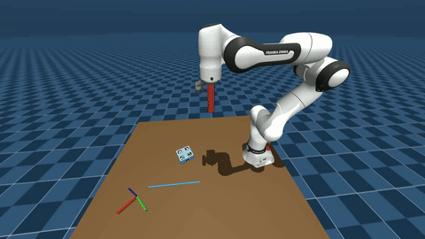
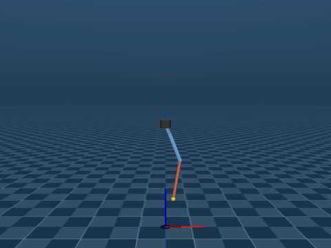

# SimCore

Modular simulation and control framework for robotic manipulation research. Built on [MuJoCo](https://mujoco.org/) and [Pinocchio](https://github.com/stack-of-tasks/pinocchio), designed as a reusable core shared across task-specific projects.

---

## Built with SimCore

| Peg-in-Hole Insertion | Vision-Based Pushing | Rotary Pendulum MPC |
|:---------------------:|:--------------------:|:-------------------:|
|  |  |  |
| [force-insertion-sim](https://github.com/AlexanderWegenerRobotics/force-insertion-sim) — diffusion policy for sub-mm peg-in-hole insertion | [vision-mpc](https://github.com/AlexanderWegenerRobotics/vision_mpc) — NMPC for planar pushing under perception uncertainty | [rotary-pendulum-sim](https://github.com/AlexanderWegenerRobotics/rotary-pendulum-sim) — LQR / iLQR / MPC benchmark for underactuated double pendulum |

---

## Overview

SimCore separates simulation infrastructure from task logic. A downstream project declares its scene in YAML and interacts with the robot through a clean API — no MuJoCo boilerplate required.

```
your_project/
├── configs/
│   ├── global_config.yaml   ← points to scene + task configs
│   └── scene_config.yaml    ← robots, objects, cameras
└── task/
    └── your_task.py         ← uses RobotSystem API
```

## Features

- **Scene composition** — assemble robots, objects, and cameras from MuJoCo XML models via YAML; no manual XML merging
- **Cartesian and joint-space control** — impedance control with SO(3) orientation error, joint position control, extensible controller architecture
- **Kinematic modeling** — FK, Jacobians, gravity compensation, and full dynamics via Pinocchio
- **Headless and real-time modes** — headless runs physics at maximum speed for data collection; real-time mode drives a live display
- **Data logging** — time-synchronized signal logging to HDF5
- **Video recording** — per-camera capture at configurable frame rates
- **Multi-robot support** — tested with Franka Panda/FR3, Boston Dynamics Spot, Unitree H1

---

## Installation

```bash
git clone https://github.com/AlexanderWegenerRobotics/SimCore.git
cd SimCore
pip install -e .
conda install -c conda-forge pinocchio
```

**Dependencies:** `mujoco`, `pinocchio`, `numpy`, `pyyaml`, `h5py`, `opencv-python`

**Note:** Install `pinocchio` via `conda-forge` before running `pip install -e .`

---

## Quick Start

A working example is in `examples/`. It moves a Franka FR3 through three Cartesian waypoints and runs in both headless and display modes.

```bash
python examples/basic_arm_control.py
```

---

## API Reference

All interaction with the simulation goes through `RobotSystem`.

### `RobotSystem(config: dict)`

Initializes the full system: loads the scene, sets up controllers and kinematics, configures logging.

```python
from simcore import RobotSystem, load_yaml

system = RobotSystem(load_yaml("configs/global_config.yaml"))
```

---

### `system.run()`

Starts the system.

- **Display mode** (`headless: False`): launches the physics thread, control loop, and blocks on the render window.
- **Headless mode** (`headless: True`): marks the system as running and returns immediately. Call `system.step()` manually in a loop.

---

### `system.step()`

Advances the simulation by one control cycle (headless mode only).

```python
for _ in range(1000):
    system.set_target("arm", {"x": target_pose})
    system.step()
```

---

### `system.set_target(device_name: str, target: dict)`

Sets the control target for a device. Only provided keys are updated.

| Key | Type | Description |
|-----|------|-------------|
| `"x"` | `Pose` | Cartesian target (position + quaternion) |
| `"q"` | `np.ndarray` | Joint position target `(dof,)` |
| `"xd"` | `np.ndarray` | Cartesian velocity feedforward `(6,)` |
| `"Fff"` | `np.ndarray` | Force feedforward `(6,)` |

```python
from simcore import Pose

# Cartesian target (impedance mode)
system.set_target("arm", {"x": Pose(position=[0.5, 0.0, 0.5], quaternion=[0, 1, 0, 0])})

# Joint position target
system.set_target("arm", {"q": np.array([0.0, -0.785, 0.0, -2.356, 0.0, 1.571, 0.785])})
```

---

### `system.set_controller_mode(device_name: str, mode: str)`

| Mode | Description |
|------|-------------|
| `"impedance"` | Cartesian impedance with null-space regulation |
| `"dynamic_impedance"` | Impedance with task-adapted stiffness profile |
| `"position"` | Joint-space PD control |

---

### `system.get_state() → dict`

Returns current state for all devices. Each value is a `RobotState`:

| Field | Type | Description |
|-------|------|-------------|
| `q` | `np.ndarray (dof,)` | Joint positions |
| `qd` | `np.ndarray (dof,)` | Joint velocities |
| `tau` | `np.ndarray (dof,)` | Applied joint torques |
| `x` | `Pose` | End-effector pose |
| `J` | `np.ndarray (6, dof)` | Geometric Jacobian |

```python
state = system.get_state()
ee_pose = state["arm"].x
print(ee_pose.position)
```

---

### `system.stop()`

Shuts down all subsystems, joins threads, and saves logged data.

---

## Configuration

### Scene config (`scene_config.yaml`)

| Key | Description |
|-----|-------------|
| `world_model` | Path to base MuJoCo XML scene |
| `headless` | `True` for fast data collection, `False` for display |
| `control_rate` | Control frequency in Hz (default: 200) |
| `render_fps` | Render frequency in Hz |
| `devices` | List of robots/actuated devices |
| `objects` | List of static props |
| `cameras` | List of named cameras |
| `logging` | HDF5 logging config |
| `video_logging` | Per-camera video capture config |

### Device entry

```yaml
devices:
  - name: arm
    type: robot
    model_path: assets/mujoco/robots/franka_fr3/fr3.xml
    urdf_path: assets/urdf/franka_fr3/panda.urdf
    urdf_ee_name: fr3_link8
    ctrl_param: configs/control/panda_arm.yaml
    dof: 7
    base_pose:
      position: [0, 0, 0.425]
      orientation: [1, 0, 0, 0]
    q0: [0.0, -0.785, 0.0, -2.356, 0.0, 1.571, 0.785]
```

### Controller params (`panda_arm.yaml`)

```yaml
default_mode: "impedance"

impedance:
  K_cart: [800, 800, 800, 80, 80, 80]
  D_cart: [80, 80, 80, 20, 20, 20]
  K_null: 10
  tau_max: [87, 87, 87, 87, 12, 12, 12]

position:
  kp: [300, 300, 300, 300, 300, 80, 80]
  kd: [40, 40, 40, 40, 40, 20, 20]
  tau_max: [87, 87, 87, 87, 12, 12, 12]
```

---

## Headless vs. Display Mode

**Headless mode** gives full control of the simulation clock to the caller — no rendering overhead. Use for fast data collection.

```python
system.run()
while not_done:
    system.set_target("arm", {"x": next_pose})
    system.step()
system.stop()
```

**Display mode** runs physics and control in background threads and blocks the main thread on the render window.

```python
import threading
task_thread = threading.Thread(target=task.run, daemon=True)
task_thread.start()
system.run()  # blocks here
system.stop()
```

---

## Project Structure

```
SimCore/
├── simcore/
│   ├── common/        # Pose, RobotState, RobotKinematics, DataLogger, utils
│   ├── controller/    # ImpedanceController, JointPositionController, ControllerManager
│   ├── simulation/    # SimulationModel, FrameDistributor
│   ├── streaming/     # GStreamer-based video streamers
│   └── core/          # RobotSystem
├── assets/
│   ├── mujoco/        # Robot XMLs, props, scenes
│   └── urdf/          # URDF models for Pinocchio
├── docs/
│   └── gifs/          # Demo clips
├── examples/
│   ├── basic_arm_control.py
│   └── configs/
└── pyproject.toml
```

---

## License

MIT